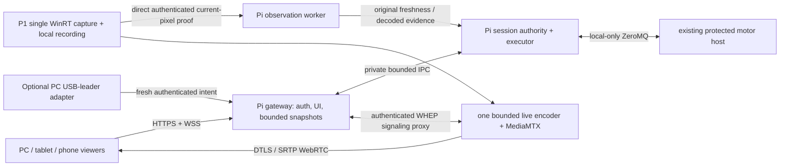

# AM1 roaming-resilient sessions

**AM1-SESSION-ARCHITECTURE-01 · 2026-10-09 · design for owner review.**
Choose a Pi-owned session authority and finite executor, an authenticated LAN
HTTPS/WebSocket gateway, and independently supervised P1 observation. Reuse the
existing UI and protected motor backend. SSH remains administrative access.

This publication authorizes no architecture implementation or deployment.
The owner replaced the proposed connection-continuity handoff and canceled the
Wi-Fi Roaming Aggressiveness experiment and its administrator question. Do not
resume that transaction. No motor/camera owner, adapter, firewall, listener or
private configuration was changed for this design.

## Verified baseline and remaining acceptance

Source inspection: clean `codex/am1-reliability-02` at
`6e50fd6b2db95d62df130dda1a21764afaf1dae8`; [PR #16](https://github.com/pickmanmike/lerobot_alohamini/pull/16)
is open/draft against `integrate/am1-local-teleop`
`9aa6d3b042a92e538213b0c684fd52d000b9cc7c`. The three published continuation
reviews were read; the owner's architecture packet supersedes the latest
adapter-experiment recommendation. Historical merged #14/#15 are preserved. Remote main remains
`ab4462b713aeb24d0473f1ec6c8812290ab19510`; all three remote branch heads were
verified before publication. Source references below describe this inspected checkpoint.

| Component | Preserved configured / recorded pin | Verification in this design |
| --- | --- | --- |
| Windows served session | `e55d390bf6e957b9adc52ccf62b69476db12a20d` | Private session config and local checkout agree |
| Pi session helper | `8e6a0cf616cb2000df1d0e996ab27a19d2fb2fba` | Private config read; current live checkout unverified |
| Pi motor | `f03de9c3b8c4f1d9e69b6951584119113ca4c5da` | Private config read; current live checkout unverified |
| Pi cameras | `9b1f0670e7068f7d39eb50270a118e3807418355` | Private config read; current live checkout unverified |
| Latest recorded observer receiver | `22c5e8892911c5074936ef785a8d2a64a95fbe07` | Inspected candidate receiver SHA-256 `43b9caa554615366d1fc01aa1139f9c7f0767528abb911bf31efac62adb3eb78` |
| P1 capture source | Separate source artifact | Candidate SHA-256 `93d7fb0c35408d96dc4a3c68b14adc7146680c4752091e7c7eb1c5eeb2c449ce` |

One bounded read-only SSH query for Pi checkout heads returned 255. This does
not establish live ownership, torque or connectivity state. Exact host/device
identity, route, repository/environment paths, credentials and calibration stay
in the existing private configuration. P1 expected identity and exact camera
selection were checked privately; use that configuration during later
stopped-owner staging. A repair checkpoint is not a wholesale deployment pin.

Preserve normal-rest automatic startup, calibrated affine raw/normalized
feedback, inward target encoding, protected measured holds, post-home quiet
feedback qualification and verified selected-gain restoration. The selected
shoulder showed delayed small outward/return movement; tighter immediate return
and useful return of every joint remain unproven. The latest powered repeat
reached **326.754/352 trajectory seconds**, 338.913 seconds in Live, three
cycles/boundaries and three same-session observation recoveries. The fourth
exhausted its budget and caused ordinary Stop with cleanup verified. Subsequent
camera-only transport failures, original receiver verdicts and supplemental
source cleanup records remain separate. Replacement transport neither fixes a
proven RF cause nor upgrades those outcomes.

**Still open:** full four-cycle 352-second workload, comparable automatic Start
after ordinary Stop and resulting normal rest, and the existing 12-second
ArmHoldBody check. Architecture documentation does not complete reliability;
trajectory fraction is not reliability probability.

## Current path to target path

| Component / host | Current connection, state owner and disconnect consequence | Target seam |
| --- | --- | --- |
| [Console](../../tools/am1_console.py#L470), Windows | Loopback HTTP; in-memory adapter and browser token. Console exit requests Stop. Second Start can attach locally. Binding is deliberately 127.0.0.1-only. | Keep assets/presentation through a new remote transport adapter; viewers attach to the robot run. Do not expose this server by changing its bind address. |
| [Session coordinator](../../tools/am1_session.py#L350), Windows | Creates session, launches native client and SSH supervision; finally stops owner/collects evidence. [SSHRemote](../../tools/am1_session.py#L763) sends commands plus 1-second heartbeats. Established loss has no attach protocol. | Move identity, lifecycle, outcome and finite authorization to Pi; retain Windows path as stopped compatibility/rollback. |
| [RemoteSupervisor](../../tools/am1_session_remote.py#L375), Pi | Already owns camera/motor children, private state and cleanup. SSH stdin EOF or 6-second laptop lease expiry stops children. | Extract ownership and cleanup from the shell-bound command reader into a resident authority. Client presence ceases to be a finite-task lifetime lease. |
| [Native Local runtime](../../examples/alohamini/teleoperate_bi.py#L2226), Windows | Owns admitted sender, measured feedback, frozen scripted seed, trajectory and Live deadline; typed [AF_PIPE bridge](../../examples/alohamini/am1_console_bridge.py#L640) binds it to Windows/browser presence. | Portable Pi executor uses the same runtime/provider contracts; no Duffy process, AF_PIPE, Windows path, keyboard import or shell stdin in finite execution. |
| [Follower client](../../src/lerobot/robots/alohamini/alohamini_client.py#L114) and [host](../../src/lerobot/robots/alohamini/alohamini_host.py#L124) | **Motor commands and feedback already use ZeroMQ TCP**, not SSH per command. Windows PUSH/DEALER talks to Pi PULL/ROUTER; host owns serial devices and local hold/zero/watchdog/epoch guards. | Keep backend initially; sole Pi executor is its local client. Bind internal sockets to loopback and restrict access. Epoch markers are ordering guards, not authentication. |
| [Virtual bench](../../tools/am1_reliability_bench.cjs#L394), Windows/browser | Playwright focus, DOM decode, key events, health-file reads and Resume HTTP requests currently carry task/observation policy. | Keep as UI compatibility/integration harness; move deterministic body input and task recovery to Pi. A viewer never supplies synthetic presence to keep a task alive. |
| [P1 capture](../../tools/am1_observer_capture.ps1#L360) and [receiver](../../tools/am1_observer.py#L394) | One Windows WinRT owner records locally and copies current pixels. SSH launches/supervises source and forwards delivery to Windows health JSON. Laptop delivery loss can invalidate observation. | P1 has explicit independent source supervision; direct authenticated frame proof reaches a Pi decoder/policy worker. No laptop health file or forwarded socket supplies robot authority. |
| [UI input](../../tools/am1_console_ui/app.js#L57) and [model](../../tools/am1_console_model.py#L37) | Focus/hide/pagehide release interactive intent. Progress assumes shared Windows monotonic clock; receipts have Windows provenance. | Preserve interactive releases; finite viewer instantiates no input lease. Display Pi-owned remaining time/provenance, with receipt age and stale status. |

P1 remains an explicit Windows observation dependency. Its retained capture
adapter can still use PowerShell locally; **Pi execution has no Windows or
PowerShell launch dependency**. Administrative SSH failure, optional viewer
failure and real required-observation loss must be different events.

## Minimal architecture and authority



Use two robot processes: an OS-managed authority/executor and an independently
restartable gateway. The authority owns run state, one action sender, fixed
deadlines, admission, recovery, first fault and cleanup. Gateway HTTP, media
signaling, downloads and blocked browsers cannot block its control cadence.
The observer decode worker is separate from both motor cadence and media
encoding. Its bounded evidence mailbox expires locally; a stalled worker
withdraws coverage rather than publishing a fresh heartbeat as observation.

The smallest service stack is **aiohttp + Python stdlib** (`asyncio`, `ssl`,
`sqlite3`, bounded queues), alongside existing Pillow and pyzmq.
[aiohttp supports HTTP and WebSocket](https://docs.aiohttp.org/en/stable/web_quickstart.html);
it is locked at 3.14.1 but is neither a declared AM1 dependency nor installed in
the inspected shared environment. Add a scoped `am1-session` extra and resolved
lock delta in implementation; do not rely on optional transitive installation.
FastAPI/Uvicorn and a separate WebSocket library are unnecessary. No ROS, MQTT,
cloud control plane, Kubernetes, GPU stack or new general autonomy framework.

On Pi, systemd starts the authority into **idle/reconciliation**, never motion.
Gateway restart is a client disconnect; authority/executor restart is a run
interruption. [systemd restart policy](https://github.com/systemd/systemd/blob/main/man/systemd.service.xml)
does not provide application resume semantics. Fake tests must establish them.
Use cooperative normal cleanup and existing local watchdogs; do not develop or
test a powered process freeze/cutoff under this design.

Keep the Pi supervisor's canonical `active.lock`, Windows controller OS lock
and camera `viewer.lock`/device checks. Stage 2 must make all supported legacy/new
launches use the **same canonical robot arbitration**, acquired before process
creation or configuration and held through verified cleanup. Add a serial-owner
kernel lock at the motor-host pre-connect boundary so direct supported host
launches cannot race the supervisor check; parent and child must not deadlock
by independently acquiring the same exclusive lock. Keep supervisor and
serial-device locks distinct. Mere lock-file presence or a process-name check
is insufficient. Unknown cleanup blocks new acquisition pending actual state
reconciliation. Preserve single-owner serial permissions and existing conflict
checks for unmanaged processes; application locks cannot constrain arbitrary
privileged external programs.

The new executor is the sole backend sender. No browser or PC adapter connects
directly to motor ZeroMQ, and no automatic fallback alternates owners after an
error. Keep the legacy owner stopped while the new path owns the robot.

## Disconnect and restart semantics

| Event | Required result |
| --- | --- |
| Viewer, laptop or administrative SSH disconnects | Accepted finite task continues **only while local feedback and required observation qualify**; its original deadline/progress remain. Reattach displays the same run without Start/home/sync. |
| Interactive controller input stops arriving | Existing 250 ms input expiry clears targets/body intent; local measured hold/zero and release/alignment gates apply. The 1.5 s presence lease can expire independently. Never replay old velocities or leader targets. |
| Required P1/required-role proof expires | Freeze trajectory and hold through the existing policy. Recover only the original qualified episode/proof within its unchanged budgets. Optional view quality cannot grant coverage. |
| Multiple viewers / controller handoff | Viewing acquires no control. One atomic claim rotates controller generation after expiry or deliberate release; no implicit takeover on reconnect. Old tab cannot reclaim with old credentials/generation. |
| Explicit Pause or Stop | Higher precedence than automated recovery and progression. Pause freezes trajectory; Stop is latched for that run and performs normal cleanup. Any later recovery proof predating operator intent is revoked. |
| Gateway restarts | Authority continues if qualified; clients attach to snapshot first. New connection grants invalidate buffered connection input. |
| Authority, executor or Pi restarts | Persisted work is `interrupted` or `uncertain`, never auto-resumed/restarted. New service generation invalidates leases/grants. Reconcile actual owner/motor state before any later deliberate Start. |
| P1 capture restarts | New capture generation cannot inherit old coverage; requalify current pixels and recording. Delivery reconnect to the same capture is not source restart. |

Retain distinct budgets: 352 trajectory seconds within the original 420-second
Live ceiling; measured preparation has its own existing 20-second wall budget;
virtual recovery is at most three episodes of 10 seconds. Native recovery has
its existing 30-second budget and 3-second automatic-pause window, measured
hold acknowledgement and three fresh samples over 0.2 seconds. Same-capture
observer delivery recovery remains three attempts within the original 5 seconds.
Moving these layers must not reset, enlarge or conflate them. Preserve the
current two-advance observation predicate and the bench's separate current
20-second continuous startup qualification; historical uninterrupted verdict
and cumulative gaps remain separate.

```mermaid
sequenceDiagram
  participant A as Client A
  participant P as Pi authority
  participant B as Viewer B
  A->>P: Start operation O, known finite recipe
  P->>P: Persist O + run R, dispatch once
  Note over A: Response lost; client disconnects
  P->>P: Advance R only on qualified local feedback / observation
  B->>P: Attach
  P-->>B: R, progress, remaining deadline, ownership, first cause
  A->>P: Retry operation O
  P-->>A: Stored result for R (no dispatch)
  Note over P: Controller handoff requires explicit atomic claim
```

## Proposed message and storage contract

Names are proposals. Use allowlisted recipe IDs rather than executable commands,
arbitrary file paths, scripts or unreviewed control parameters.

| Operation | Minimal contract |
| --- | --- |
| `GET /api/state` | Current run, phase, state version, service generation, immutable recipe/pins, remaining Live time, trajectory, controller generation/expiry, feedback/observation validity, recovery budget, first fault, cleanup state; unavailable fields remain unavailable. |
| `POST /api/tasks` | Authenticated controller with current generation requests a known recipe using `operation_id`. Atomically persist operation, canonical recipe hash and new `run_id` before dispatch. |
| `GET /api/operations/{id}` | Query accepted, refused, terminal or uncertain outcome after a lost response. Same operation + same recipe returns its recorded result; changed payload is conflict. |
| `POST /api/attach`, `WSS /api/events` | Return authoritative snapshot and a short-lived connection ticket; acknowledge snapshot/state version before sending input. No queued movement/event replay. |
| `POST /api/control/claim`, `release` | Serialize lease check, explicit handoff and generation rotation under one authority lock. Release clears input and revokes grants; claim does not itself Resume. |
| `WSS input` | Exact run/service/controller/connection generation, increasing sequence, server-issued short-lived grant and latest current intent. One latest-valid mailbox. |
| `POST /api/runs/{id}/pause`, `resume`, `stop` | Idempotent operation IDs and exact run. Resume needs current measured alignment, fresh empty release/current evidence and appropriate ownership/proof. Authorized Pause/Stop remain available without owning the input lease. |

Illustrative Start and snapshot (IDs abbreviated; no secrets):

```json
{"operation_id":"O","service_generation":"S","task":"ArmSmokeRepeat","recipe_id":"reviewed-recipe-v1","controller_generation":7}
{"run_id":"R","operation_id":"O","service_generation":"S","phase":"running","input_mode":"finite","trajectory_s":88.2,"live_remaining_s":328.1,"controller_generation":7,"state_version":42,"required_observation":"qualified"}
```

`run_id` identifies one physical attempt; `operation_id` deduplicates a request;
`service_generation` identifies one authority incarnation; controller generation
fences lease handoff. Backend host epochs remain an additional protection,
not substitutes for those identities.

SQLite stores small operation/run records, recipe/source hashes, transitions,
first cause, terminal/uncertain result and owner-reconciliation state. Record
`accepted` before dispatch and `dispatching` before effects. A crash around
dispatch or an unpersisted terminal boundary is **uncertain**, not proof that
effects occurred or did not occur. No exactly-once physical-effect guarantee.
On restart, historical accepted operations return historical outcomes and never
dispatch again; a new deliberate Start needs a new ID and reconciled state.
Keep deduplication tombstones when pruning large artifacts so an old ID cannot
later become a fresh Start. No high-rate control samples in SQLite; original
bounded logs/recordings remain private artifacts.

All enforcement deadlines use the authority's local monotonic clock. Browser
countdowns interpolate a server remaining duration for display only; client
wall time and remote absolute monotonic times grant no motion authority. Reboot
invalidates saved monotonic deadlines. Persistence carries identity/outcome and
wall-time context, not a valid resumed motion clock.

Interactive input uses server grants valid for **at most the existing 250 ms**,
with expiry anchored to grant issuance, not delayed packet receipt. The trusted
adapter samples current keys/leader intent after receiving a grant, sends one
latest update and clears its buffer on reconnect/handoff. Validate service,
run, controller and connection generations plus sequence and unexpired grant.
A new connection requires snapshot acknowledgement and fresh empty input before
alignment/Resume. Receipt time alone cannot freshen buffered targets; client
monotonic timestamps are diagnostic only. This bounds delivery from the grant
and assumes a correct trusted input adapter; it does not attest malicious
client hardware sampling. USB leader calibration/alignment stays in the PC
adapter; a phone has no implicit USB-leader capability.

Starting finite execution records an immutable run authorization separately
from the interactive lease. Loss of that lease does not revoke an already
accepted finite recipe. It cannot append new movement or bypass required
coverage. Explicit operator intent increments a revision checked atomically
before each recovery/progression commit.

Proposed initial resource limits: four attached clients; one latest snapshot
and 64 recent events; per-client output at most 64 KiB; control messages at most
4 KiB; one latest input and one latest observation frame. Slow subscribers get
a dropped-events indicator/resnapshot or disconnect. Stop/Pause have a reserved
bounded control path and cannot be coalesced behind input, logs or media.
Validate size/rate before allocation. Original logs/downloads are lower priority
and cannot block motion or fabricate cleanup_unknown on normal browser closure.

## P1 media, observation and LAN access

**Choose MediaMTX on P1 with one FFmpeg live encoder fed copied WinRT frames.**
The current owner already records 1280×720 H264/10 fps locally while its same
MediaCapture frame reader copies pixels. Keep that recording and exact device
selection. Add a bounded copied-frame bridge (explicit format/stride) to one
640×360, at most 10 fps live encoder; start qualification with baseline H264,
yuv420p, no B-frames and roughly 600 kbit/s. These are proposed live settings,
not a recording change or measured CPU/phone result.

[MediaMTX routes media and requires a publisher](https://mediamtx.org/docs/kickoff/introduction);
[reencoding is external](https://mediamtx.org/docs/features/remuxing-reencoding-compression).
Use FFmpeg to publish one authenticated loopback-only RTSP path, then MediaMTX
fans it out as WebRTC. Never use a second dshow camera reader or the growing MP4
as a live source. One latest pending frame, one encoder and at most two initial
WebRTC viewers keep fanout bounded; source recording/proof cannot wait for them.
RTSP credentials/config and diagnostics remain private.

aiortc would also need the WinRT frame bridge plus PyAV, ICE/crypto dependencies
and application signaling; [MediaRelay](https://aiortc.readthedocs.io/en/latest/helpers.html)
shares a source, while raw-frame [sender encoding](https://github.com/aiortc/aiortc/blob/main/src/aiortc/rtcrtpsender.py)
can multiply with viewers. MediaMTX/FFmpeg adds two explicit Windows binaries,
but avoids creating another media/signaling implementation in the robot service.
Neither is installed for this packet. Pi needs no video encoder or PyAV for
current JPEG qualification. Do not assume hardware encoding or mobile H264
support: [MediaMTX documents browser codec constraints](https://mediamtx.org/docs/features/webrtc-specific-features).
Defer data-channel input and QUIC/WebTransport.

**Required observation is a separate direct path.** Pi issues a fresh nonce
over authenticated P1 WSS; P1 binds a later captured frame to that nonce, exact
configured source identity, capture generation, run and advancing sequence.
Pi decodes the associated JPEG pixels, checks dimensions/framing metadata and
ages the evidence through decode completion and actual executor consumption.
Reuse the existing causal bound: Pi's own round trip minus only the elapsed
challenge-to-capture duration measured on P1 QPC, with its precision margin and
contradiction checks. Never subtract P1 absolute QPC from Pi monotonic time.
Required effective source age stays at most 500 ms; original nonce lifetime
stays 750 ms. Expired, malformed, foreign, replayed or undecoded frames do not
qualify. Reconnection cannot reissue an old nonce with a new timestamp.

No SSH forwarding-only process, laptop JSON sharing fallback or browser DOM is
in this new proof path. A heartbeat, counter or playing video is insufficient.
This establishes current pixels from the trusted configured capture agent,
not scene safety or malicious-host attestation. Framing/coverage must remain
qualified for arms/lift and separately for body; if an onboard semantic role
is required, provide a non-browser bounded decoded receiver before using it as
authority. Do not convert all five optional views in the initial media stage.

P1 capture supervision must outlive viewers and SSH. Retain a finite
run-associated capture/recording budget, disk cap, normal terminal result and
camera release. A machine-authenticated observer adapter starts/attaches the
known bounded recipe independently of media viewers. Proposed Windows
supervision uses the established camera-capable user context at logon with
private permissions; do not assume WinRT camera access in LocalSystem/session 0.
Camera privacy consent, logged-in/locked/logout/sleep/reboot behavior, graceful
agent restart and CPU/recording contention need qualification before deployment.
Windows [service session isolation](https://learn.microsoft.com/en-us/windows/win32/services/interactive-services)
is a concrete limitation. Preserve existing consent; do not bypass camera privacy
or introduce blanket privacy changes to make an unattended service work.
A lost proof connection cannot extend recording indefinitely or replay an old
capture Start.

Use the Pi as the single browser HTTPS origin. Authenticate same-origin WHEP
POST/PATCH/DELETE through `/media/p1/...`; the gateway authenticates separately
to P1 with read-only path-scoped credentials. MediaMTX's
[WHEP reader protocol](https://github.com/bluenviron/mediamtx/blob/v1.21.1/internal/servers/webrtc/reader.js)
uses a returned session Location plus trickle PATCH and DELETE. Rewrite Location
to a device-bound opaque same-origin handle, validate/persist the exact allowed
upstream resource privately and protect every method with auth, Origin and CSRF.
Preserve SDP Content-Type, ETag/If-Match and necessary Link headers. No arbitrary
URL proxy, credential-bearing redirect or secret UUID logging. Session expiry/
revocation performs bounded best-effort upstream DELETE and reports failure.
Adapt the reader fetch path for CSRF; prefixing POST alone is insufficient.

Media DTLS/SRTP goes directly P1→browser. Use MediaMTX's
[fixed local UDP candidate port](https://mediamtx.org/docs/references/configuration-file)
and verified LAN candidate address, no public STUN/TURN or router forwarding by
default. Disable unused protocols/listeners; restrict P1 signaling to the Pi
service and publication to local authenticated processes. Media permissions
follow [path-scoped authentication](https://mediamtx.org/docs/features/authentication).
The inspected [v1.21.1 defaults](https://github.com/bluenviron/mediamtx/blob/v1.21.1/mediamtx.yml)
require explicit override: remove anonymous publish/read users, one named path
with a reader cap and no always-available playback, loopback RTSP/TCP, selected
LAN WebRTC address/UDP port and empty ICE-server list. Disable unused HLS, RTMP,
SRT, MoQ, playback, API, metrics and profiling listeners. Recheck the chosen
release at implementation; do not ship stock public defaults. The signaling
proxy must not become a motion dependency.

Proposed LAN enrollment:

1. Verify a unique robot mDNS name, such as `am1.local`, using existing
   [Avahi capability](https://avahi.org/); if absent, its small OS package/service
   is a later explicit dependency. Stable URL and certificate identity survive
   DHCP address changes; no identity is tied to the client's IP. Verify actual
   PC/Android/iOS resolution and name conflicts before promising compatibility.
2. Use a dedicated private CA and robot DNS-name certificate. Protect the CA
   key offline in private administrative storage; Pi holds only its leaf key.
   Trust that CA on explicitly enrolled devices, never the entire network.
   iOS requires [explicit SSL trust for manually installed profiles](https://support.apple.com/en-us/102390).
   Renew the leaf on a defined schedule (initial proposal: 90 days), surface
   approaching expiry, and retain the same name/CA. Replacement CA requires
   reenrollment; never disable TLS verification to work around expiry.
3. Enable a short-lived one-use pairing code only through authenticated local/
   administrative setup. Display it privately, rate-limit attempts and disable
   open pairing by default. Each device gets a revocable opaque credential in
   a Secure/HttpOnly/SameSite=Strict cookie; store only its hash and capabilities.
   No IP allowlist is a device identity.
4. Require HTTPS for HTTP, WSS and signaling; exact Host/Origin allowlists,
   CSRF on mutations (including WHEP), authenticated WebSocket upgrade and
   short-lived single-use attach ticket carried in the first WSS message,
   with no protected data/input before ticket verification. Cookies use the
   `__Host-` prefix. Do not put long-lived secrets in URL,
   frontend source or logs. P1 machine credentials are separate, scoped and
   privately pinned/rotatable. Reject untrusted origins; no wildcard CORS.
5. Later install rootless service units with narrowly scoped state/log access,
   serial/camera permissions only for owning components, private files/keys,
   and bounded storage. Allow only selected LAN HTTPS/media/mDNS traffic if
   required; internal serial/ZeroMQ remains nonpublic. Preserve existing ACLs.

Before any such install, do one **no-hardware narrow reachability check** with
the intended authenticated temporary listener: verify Pi HTTPS plus P1 signaling
and fixed media port from an enrolled PC and phone, then remove the temporary
listener/rules if not adopted. The earlier failed port test established no
direct reachability. Identify any exact Windows listener/firewall permission
and Linux service permission first; this is later installation work, distinct
from the canceled adapter/AP experiment. Do not disable firewalls, loosen
network-wide trust or substitute an essential permanent SSH tunnel.
If mDNS is unavailable on a target device, report that qualification gap and
review a single stable private address/certificate alternative separately;
do not silently begin home-network tuning.

## Ordered migration and rollback

Each stage has one next stage; no full legacy endurance pass is a prerequisite
to building its replacement. Create no new repository, retarget or merge now.
After design approval, prefer `codex/am1-persistent-session-fake` stacked on
the published PR #16 documentation checkpoint (runtime baseline 6e50fd6).
Keep repair PR #16 draft; the implementation follow-up explicitly depends on it.
Integrate retained repairs into `integrate/am1-local-teleop` in their reviewed
order, then the proven session slices; main remains unchanged. If PR #16 cannot
close until the new path supplies reliability evidence, keep the dependency
stack explicit and report which branch produced that evidence.

| Stage / visible outcome | Files and interfaces changed | Retained components / smallest acceptance | Deployment delta / rollback / next |
| --- | --- | --- | --- |
| **1. Fake persistent vertical slice**: two real browser contexts see one fake run across reload | Contract/core/IPC/gateway/fake adapter and UI transport listed below | No hardware imports or devices. Real HTTPS/WSS, SQLite, OS lock and process separation; deterministic cases below | Development loopback only, scoped aiohttp dependency; no Pi/P1 deployment or service installation. Stop fake processes/remove generated test state; legacy untouched. Next: stage 2 |
| **2. Pi owner + one finite profile**: local admitted executor no longer depends on Duffy lifetime | Extract `am1_session_runtime.py` from native sender/admission loop, `am1_finite_task.py` over current providers; `am1_pi_executor.py`; share ownership/cleanup from `am1_session_remote.py`; canonical arbitration and host pre-connect lock/local bind | Existing calibration, motor/feedback/thermal/status guards, measured hold and ordinary cleanup. Fake backend parity + Linux ownership/refusal + one bounded native recipe; **no powered independence claim yet** while observer is still legacy | Exact executor/helper and narrowly required host lock/bind delta staged only after affected owners are stopped. Keep original pins/units/config copies. Roll back only affected components after verified Stop; no alternate-owner retry. Next: stage 3 |
| **3. Independent P1 required proof + media**: no laptop/browser observation authority | Portable `am1_observer_receiver.py`, `am1_observation_policy.py`; P1 copied-frame/machine adapter; MediaMTX/FFmpeg and gateway WHEP adapter | Existing single capture, local recording, source identity, causal pixels, budgets and original failure taxonomy. First no-motor recording/proof/framing/decode + bounded recovery test, then one supported small task | Only named Pi observer/executor and P1 capture/media/listener permissions, independently pinned. Reuse unchanged onboard cameras/motor code. Stop affected owners and restore exact P1/receiver config/source to rollback; legacy observation remains explicitly laptop-dependent. Next: stage 4 |
| **4. Actual end-to-end continuity**: complete operating evidence | Qualification harness/reporting and only demonstrated blocked-layer corrections | Original four cycles/352 trajectory within 420 Live, ordinary Stop→natural rest→comparable automatic Start/confirmation, existing ArmHoldBody 12 s with reviewed W/A/U/J pulses. Required current pixels/feedback throughout, honest useful motion and cleanup | Stopped affected-component staging only if a tested correction is necessary. New-path acceptance closes administrative SSH and detaches clients while task remains qualified, then real PC/tablet/phone tests. Restore stopped legacy path only after verified cleanup. Next: review final operating evidence/integration |

Stage 2 may use an explicit legacy-observer compatibility adapter for offline
parity and later bounded qualification, but must label its laptop dependency.
Stage 3 removes it before claiming SSH/laptop-independent powered operation.
Keep manual physical-leader operation available via the existing adapter and
guidance; do not move leaders or expand that acceptance campaign here.

Relative effort: stage 1 is small-to-medium new service/protocol work with high
reuse of UI assets and fake harness patterns; stage 2 is medium extraction and
ownership work with substantial runtime/provider reuse; stage 3 is the largest
uncertainty (WinRT bridge, Windows supervision, codec/CPU, LAN reachability and
current-pixel qualification); stage 4 is bounded hardware evidence and only
demonstrated repairs. These are relative engineering estimates, not elapsed-time
promises. Existing motor repairs are retained work, not a rewrite allowance.

## Exact first-slice implementation brief

Approval requested is for **stage 1 only, fake hardware**, on the stacked
follow-up branch. No motor/camera access, Pi/P1 install, listener/firewall change,
adapter elevation or runtime architecture deployment is included.

| Proposed file | Responsibility |
| --- | --- |
| `examples/alohamini/am1_session_contract.py` | Hardware-free immutable identity/spec/evidence/result schemas; allowlisted finite/interactive test recipes |
| `tools/am1_session_core.py` | Resident authority actor; atomic claim/intent revision, operation deduplication, SQLite minimal store, common OS ownership lock and reconciliation state |
| `tools/am1_session_ipc.py` | Private bounded JSON IPC; Linux Unix socket, portable authenticated loopback adapter in Windows fake tests; bytes-only framing, no untrusted pickle or shell commands |
| `tools/am1_session_service.py` | aiohttp HTTPS/WSS gateway, authentication/Origin/CSRF, attach snapshot and bounded per-client output; gateway lifetime independent of owner |
| `tools/am1_fake_executor.py` | Explicit fake feedback/observation/owner adapter, injected clock and finite progress; cannot import or construct real hardware |
| `tools/am1_console_ui/session_transport.js` plus narrow `app.js`/`index.html` adapter | Reuse UI assets; remote snapshot/operations, spectator finite view and explicit interactive lease mode; retain legacy transport |
| `tests/robots/test_am1_persistent_session.py`, `test_am1_session_api.py` and `tests/cameras/test_am1_session_clients.cjs` | Deterministic core/restart/lock tests plus loaded two-context real HTTPS/WSS integration |
| `pyproject.toml`, `uv.lock` | New scoped aiohttp extra only; preserve unrelated pins/environments |

Use short virtual-clock fixtures with the same separate trajectory/Live-deadline
semantics; do not need 352 real wall seconds to test reconnect. The production
registry in this slice exposes only fake recipes. Test-only clock/fault controls
are private harness interfaces, never public runtime operations.

Acceptance cases:

1. Accept Start, lose response after durable acceptance, retry same operation:
   one run/dispatch. Conflicting recipe hash refused. Crash before/after dispatch
   boundaries reports interrupted/uncertain without automatic effects.
2. Disconnect/reload A while finite progress advances; B and returning A attach
   to identical run, seed, progress and original deadline. No Start/home/sync;
   neither viewing nor absence acquires control.
3. Interactive 250 ms grant/input expiry zeros body/clears stale targets; delayed,
   reordered, old-generation and reconnect-buffered input cannot execute.
   Fresh empty release/alignment is required before Resume.
4. Simultaneous claims serialize; explicit A→B handoff rejects A's old generation.
   B viewing alone cannot claim. Test unauthorized claims, origins and payloads.
5. Optional view loss records quality only; required proof loss freezes progress
   and uses original recovery budget. Operator Pause/Stop racing recovery wins;
   late accepted request is not native active acknowledgement.
6. Restart gateway while owner advances. Restart authority/executor with persisted
   run: new generation, interrupted/uncertain result, no resume/duplicate Start.
   Old monotonic deadline and old operation ID cannot reactivate work.
7. Two processes contend for one real OS arbitration lock representing legacy/new
   owners: only one admitted owner. Unknown cleanup blocks Start. Slow WebSocket,
   saturated logs or disconnected download cannot block cadence or Stop/Pause.
8. Loaded UI in two browser contexts uses real HTTP/WSS/auth and snapshot attach.
   No mocked fetch-only claim of service integration; no physical-device or
   access-point roam claim from those contexts.

Run focused new tests and relevant retained lease/pause/provider/policy tests.
Reuse unchanged historical verification rather than rerun every repair suite.
Linux IPC/flock and Windows IPC/locking need distinct portability checks before
stage 2. Actual phone codec, certificate trust, mDNS and roam evidence belongs
to later device acceptance. Deterministic fake interruption needs no WLAN
sabotage or powered-process termination.

## Publication review and decision

This is a documentation-only checkpoint. One independent focused read-only
review inspected the actual document against the full architecture packet and
found no actionable material gaps in lifetime, ownership, duplicate effects,
observation validity, security, portability or scope. Source audits covered
lifecycle, finite input/observation and media/access feasibility. Documentation
checks passed for local links/source anchors, private-data exclusion, balanced
diagram fences and diff whitespace. No runtime tests or device actions were
performed for this design; historical test results are not new test passes.

Rollback of this publication is an ordinary documentation revert. Later code
rollback is component-specific, with original pins/private permissions retained,
verified stopped affected owners and one enabled motion path. No automatic
switch to a second serial owner.

**Owner decision:** approve this consolidated design and authorize the exact
stage-1 fake-only implementation brief on the stacked follow-up branch.
Deployment and subsequent hardware stages remain separately reviewable.
