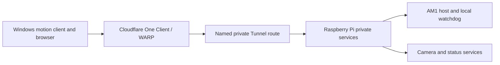
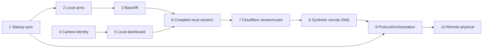

# Aloha Mini 1 Complete Local and Remote Teleoperation Master Plan

> **For agentic workers:** REQUIRED SUB-SKILL: Use
> `superpowers:subagent-driven-development` (recommended) or
> `superpowers:executing-plans` to implement one approved packet at a time.
> Physical-motion, service, package, firewall, and Cloudflare account gates
> always require the authorization named by that packet.

**Goal:** Deliver a dependable hobby-grade Aloha Mini 1 system for complete local and remote bimanual arm, three-wheel base, lift, and five-camera teleoperation.

**Architecture:** The Raspberry Pi owns robot hardware and local safety. A native Windows process remains the only motion client. LAN traffic uses direct TCP; remote traffic uses Cloudflare One Client/WARP through a named private Tunnel route. A separate camera gateway serves an authenticated browser dashboard and never owns motion.

**Tech stack:** Python 3.12, LeRobot 0.6.1, pyzmq, Feetech SDK, native Windows, Raspberry Pi 5/Debian 13, V4L2 native MJPEG, go2rtc with µStreamer fallback, native systemd, and Cloudflare Tunnel/WARP.

## Global Constraints

- Aloha Mini 1 only; preserve Aloha Mini 2 and Aloha Mini 2 Pro behavior.
- Preserve completed follower and leader calibration, including leader ID `so101_leader_bi`, COM7 left, and COM8 right.
- Raspberry Pi commit `a8538bd79356b4c5263342aba389dcdf39092e9e` remains the deployed safe-bringup baseline until a separately reviewed Pi packet changes it.
- Implement the approved startup-sync plan before complete local motion.
- Local zeroing, stale-command response, watchdog, and physical power removal never depend on Cloudflare.
- Native Windows remains the sole arm/base/lift command client; the browser is video/status only.
- One operator command source at a time.
- Motor host never starts automatically or automatically resumes motion.
- Camera gateway and motor host never intentionally share a V4L2 device.
- No public raw ZMQ port, public browser-motion endpoint, or router port forwarding.
- No Docker, ROS conversion, Kubernetes, or large frontend framework.
- Use native compressed camera output; do not add five software transcodes.
- Cloudflare secrets, viewer credentials, private keys, and tokens never enter Git or logs.
- Stop at every physical-motion, package/service, firewall, and account-change gate for authorization.
- Record measured facts separately from provisional targets and inferences.

---

## 1. Known Baseline

The companion discovery report at `docs/reports/2026-08-16-am1-teleoperation-discovery.md` is the source for exact commands and evidence.

### Working components

- AM1 body IDs: left wheel 8, rear wheel 9, right wheel 10, lift 11.
- Bounded body-direction and lift-direction tests have passed.
- Follower calibration is complete on the Pi.
- Leader calibration is complete on Windows.
- Windows normalized AM1 action-space correction is present.
- LAN reachability to Pi `192.168.1.134` has passed.
- Pi safe-bringup commit seeds follower goals before torque, zeros body velocity before torque, cleans partial activation failures, and blocks lift movement when unhomed.
- Current ZMQ transport uses TCP 5555 for commands and TCP 5556 for observations.
- Four cameras can concurrently capture native MJPG 640×480 without an observed USB reset or power warning.

### Gates that block a complete system

- Startup synchronization is designed but not implemented.
- Fifth camera does not enumerate.
- Camera role mapping is unresolved.
- Lift lower-stop sustained load has not been measured.
- Current watchdog does not require a new claim/ARM before later commands.
- Reliable claim/ARM/DISARM transport is not designed.
- Camera gateway, service orchestration, Cloudflare, and firewall policy are absent.

## 2. Approved Direction and Remaining Design Gates

### 2.1 End-state ownership

| Responsibility | Owner |
|---|---|
| Follower arms, base, lift, homing, torque, watchdog | Raspberry Pi motor host |
| Passive leaders, normalized samples, keyboard, startup gates | Native Windows client |
| Five V4L2 devices and browser video | Standalone Pi camera gateway |
| Read-only health presentation | Pi status service and browser dashboard |
| Identity-aware remote transport | Cloudflare One Client/WARP and named Tunnel |
| Ultimate stop | Local software watchdog plus accessible motor-power removal |

Camera or Cloudflare failure must never weaken the Pi watchdog. Conversely, camera and tunnel services must not start the motor host.

### 2.2 Local topology

```mermaid
flowchart LR
    W["Windows leaders and keyboard"] -->|"Direct LAN TCP"| H["Pi AM1 motor host"]
    H --> M["Follower arms, base, and lift"]
    B["Local browser"] -->|"TCP 1984"] G["Hardened camera gateway"]
    G --> C["Five V4L2 cameras"]
    S["AM1 status generator"] --> G
```

### 2.3 Remote topology



### 2.4 Operator sequence

Local:

1. Verify the robot/workspace and motor disconnect.
2. Open `http://192.168.1.134:1984` and verify all required views are fresh.
3. Confirm status shows motor host `OFF`.
4. Explicitly start the motor host.
5. Start the native Windows client.
6. Run strict alignment or the approved startup synchronization.
7. Complete the engagement gate required by the current approved packet.
8. Teleoperate arms, base, and lift.
9. Exit/disarm the Windows client.
10. Stop the motor host; leave camera/status services online.

Remote adds WARP connection and the private hostname before step 2. No workflow silently falls back from a failed private route to a public endpoint.

### 2.5 Motion semantics approved now

- One operator session.
- Host states ultimately become `DISARMED`, `SYNCING`, and `ARMED`.
- Startup synchronization precedes ordinary forwarding.
- Exact uppercase `ARM` is required before normal motion in the final remote-safe protocol.
- ARM must atomically carry the final sequence-fresh, validated leader action with explicit zero base/lift.
- No unchecked leader read occurs between final approval and that first action.
- Disconnect, stale command, host restart, invalid ordering, or competing ownership latches `DISARMED`.
- Base/lift receive zero while followers hold current or last safe targets.
- Recovery requires fresh leader/follower observations, alignment validation, and explicit re-arm.
- No automatic motion resumption.
- AM2 and AM2 Pro retain their current protocol and behavior.

### 2.6 Reliable-protocol design gate

The wire transport is deliberately not selected in this master plan. Packet 9 begins with a separate protocol design and approval before any envelope implementation.

It must compare at least:

1. A new reliable control socket for claim/ARM/DISARM plus the existing conflated latest-action socket.
2. Bidirectional lifecycle messages over the existing DEALER/ROUTER observation channel without starving observations.
3. Another explicitly acknowledged reliable mechanism, if it is simpler and testable.

The design must decide:

- socket pattern and port count;
- message framing and version negotiation;
- ownership claim, expiry, replacement, and release;
- acknowledgement, timeout, retry, and idempotency;
- sequence and replay rules;
- atomic ARM-with-first-action handling;
- DISARM priority and acknowledgement;
- what `ZMQ_CONFLATE` may and may not carry;
- split-channel loss, reconnect, and host-restart behavior;
- local watchdog fallback when the reliable channel is unavailable;
- AM1-only activation and AM2 isolation;
- Cloudflare application/policy count;
- fake and synthetic fault matrices.

Claim, ARM, and DISARM must not be assumed reliable on the conflated latest-only action stream.

## 3. Decision Record

| Decision | Selected direction | Material alternative and trigger |
|---|---|---|
| Motion client | Native Windows | Browser/gamepad motion rejected for v1; it would duplicate safety and calibration logic. |
| Local network | Direct LAN IP | Remains available when Cloudflare is unavailable. |
| Remote network | WARP → named private Tunnel route | Public Access TCP rejected for long-lived motion; Mesh only after measured Tunnel instability. |
| Camera ownership | Standalone gateway during teleoperation | Existing host camera ownership used only during explicit recording handoff. |
| Camera gateway | One hardened go2rtc v1.9.14 process | Five µStreamer v6.62 processes plus narrow gateway if security/recovery tests fail. |
| MediaMTX | Rejected for initial USB capture | Reconsider only if routing/recording needs later justify another media layer. |
| Video codec | Native camera MJPG | H.264 unavailable from observed cameras; raw YUYV exceeds practical USB2 capacity. |
| Dashboard | Small static HTML/CSS/JS | No frontend framework. |
| Services | Native systemd | Docker adds daemon, volume, secret, and device-mapping complexity. |
| Engagement | Latched explicit engagement | Held keyboard/gamepad deadman rejected for v1; local watchdog remains mandatory. |
| Lifecycle transport | Separate design required | Do not lock one socket or Cloudflare app count before Packet 9. |
| Recording | Explicit ownership handoff | Simultaneous camera opening rejected. |

## 4. Open-Source Reference Review

| Pattern | Source | What it supports | Decision | AM1 reason | Packet |
|---|---|---|---|---|---|
| AM1 roles and Pi ownership | `liyiteng/AlohaMini` `17c6a98d…` | Five roles and Pi-centered hardware | Adopt/adapt | Preserve roles; map to observed wiring, not AM2 assumptions. | 4–5 |
| Pi/PC host split | Deployed `liyiteng/lerobot_alohamini` `a8538bd…` | ZMQ 5555/5556, keyboard body, camera-in-host, recording | Adopt/adapt | Keep split and controls; separate cameras and add safety lifecycle. | 1–9 |
| Direct leader/follower mapping | SO-ARM100 `7629d2ad…` and LeRobot SO-101 docs | Calibration identity and direct mirroring | Adapt | Direct mirroring only after normalized correspondence and alignment. | 1–2 |
| Alignment and engagement | LeRobot Isaac teleop `6adf5151…` | Measured anchoring, slew, hold, cleanup | Adapt behavior/tests | AM1 is bimanual, normalized, and networked; do not copy single-arm helpers. | 1, 9 |
| Mobile Pi client | LeKiwi docs | Pi host, laptop client, ports, keyboard mobility | Adapt | Extend to two arms, three-wheel base, and lift. | 2–3, 8 |
| Aliases and exclusive camera processes | Original ALOHA `06369f03…`; Mobile ALOHA `0e40324` | Semantic aliases, hub cautions, staged recording | Adopt/adapt | Keep semantics and exclusivity; reject raw YUYV/60. | 4–5 |
| Operator workflow/status | XLeRobot `3d14695e…` | Dual-arm mobile workflow and UI ideas | Adapt | It does not own AM1 lift/base/safety. | 5, 9 |
| Browser/status/recording UI | Phosphobot and LeLab | SO-101-oriented UI/server workflows | Adapt ideas only | Reject replacement runtime and browser motion. | 5, 9 |
| Camera interfaces and ZMQ | LeRobot camera/ZMQ/encoding docs | Semantic cameras, latest frames, dataset encoding | Adopt/adapt/reject | Keep interfaces; reject current combined/base64 viewer transport. | 4–5 |
| Native V4L2 MJPEG | [go2rtc v1.9.14](https://github.com/AlexxIT/go2rtc/releases/tag/v1.9.14) | V4L2 source, preload, MJPEG/snapshot API, static UI | Adopt conditionally | Simplest one-process gateway if API hardening and recovery pass. | 5 |
| Native MJPEG leaf service | [µStreamer v6.62](https://github.com/pikvm/ustreamer) | One V4L2-to-HTTP process with HW MJPEG passthrough | Fallback | Better fault isolation if go2rtc fails the gate. | 5 |
| Media router | [MediaMTX v1.20.0](https://github.com/bluenviron/mediamtx/releases/tag/v1.20.0) | Multi-protocol routing; webcam recipe uses FFmpeg | Reject initially | Adds producer/transcode complexity. | 5 |
| Private hostname routing | [Cloudflare private hostname](https://developers.cloudflare.com/cloudflare-one/networks/connectors/cloudflare-tunnel/private-net/cloudflared/connect-private-hostname/) | Private TCP/HTTP routing through One Client | Adopt | Avoids public raw motion ports and client-side TCP wrapping. | 7–10 |
| Network authorization | [Cloudflare network policies](https://developers.cloudflare.com/cloudflare-one/traffic-policies/network-policies/) | Identity, posture, hostname, port allow/block | Adopt | Private routes alone are insufficient authorization. | 7, 9 |
| Mesh | [Cloudflare Mesh](https://developers.cloudflare.com/cloudflare-one/networks/connectors/cloudflare-mesh/) | Beta L3/L4 connectivity through Cloudflare | Measured fallback | Not needed unless Tunnel soak fails; not an outage fallback. | 8 |

Source-derived conclusions, Pi observations, AM1 adaptations, and unresolved measurements must remain labeled separately in every packet report.

## 5. Camera Strategy

### 5.1 Identity and topology

Final aliases are fixed; role-to-path mappings are not:

```text
/dev/am_camera_forward
/dev/am_camera_backward
/dev/am_camera_chest
/dev/am_camera_wrist_left
/dev/am_camera_wrist_right
```

Udev rules must match `SUBSYSTEM=="video4linux"`, `ATTR{index}=="0"`, and the final observed `ID_PATH_TAG`. Do not use the shared serial `SN0001`, product name alone, or dynamic `/dev/videoN` numbering.

Packet 4 must:

- wait until tape removal is approved;
- identify the absent fifth camera;
- perform a human view check for every role;
- label cables and physical ports;
- prefer approximately 2–2–1 distribution across independent controller segments where practical;
- keep motor-controller reliability in scope;
- prove reconnect and reboot persistence;
- repeat simultaneous capture under realistic uncovered motion and lighting.

A powered hub is used only if cable, port, or measured power qualification requires it. `get_throttled=0x0` during the four-camera probe does not establish this.

### 5.2 Stream profile and dashboard

- Capture: native `MJPG`, 640×480, requested 30 fps.
- Record actual per-camera rate; do not claim the negotiated rate was delivered.
- Preload all five streams in go2rtc.
- Primary: continuous `/api/stream.mjpeg?src=<role>`.
- Thumbnails: `/api/frame.jpeg?src=<role>&cache=500ms`, refreshed at 2 Hz.
- Clicking a thumbnail swaps it with the primary.
- Browser CSS scales images; no server resize/re-encode.
- No audio, WebRTC, RTSP, DVR, or recording in v1.

Enable only go2rtc modules `api`, `streams`, `v4l2`, and `mjpeg`. Disable RTSP and WebRTC listeners, FFmpeg, exec, discovery, and configuration editing. Use Basic authentication with `local_auth: true`; load credentials from systemd credentials or a root-readable non-repository file.

### 5.3 Mandatory positive and negative security gate

Authenticated positive checks must prove:

- dashboard `/` and static assets load;
- `/api/stream.mjpeg?src=<role>` returns MJPEG;
- `/api/frame.jpeg?src=<role>` returns JPEG;
- `/status.json` returns read-only health data.

Negative checks must prove:

- every required path rejects missing credentials;
- `/api`, `/api/config`, `/api/streams`, mutation, restart, log/debug, WebSocket, discovery, and every other administrative path is unavailable with valid viewer credentials;
- ports 8554 and 8555 are not listening;
- no config editor or endpoint can disclose configuration or credentials.

If the required viewer paths cannot coexist with this deny result, reject go2rtc. Deploy five µStreamer processes bound behind one minimal authenticated gateway that exposes only dashboard, MJPEG, snapshots, and status.

### 5.4 Disconnect and ownership behavior

With motors off, disconnect and reconnect one camera. The other four must remain live; the failed role must become visibly stale/unhealthy and recover within ten seconds. Failure selects the µStreamer fallback or blocks Packet 5.

Recording handoff:

1. Disarm and stop the motor host.
2. Stop the gateway.
3. Confirm every camera is unowned.
4. Start the existing host/recording path with cameras enabled.
5. Record and perform failure-preserving cleanup.
6. Stop the recording host and confirm cameras unowned.
7. Restart the gateway.

## 6. Cloudflare and Firewall Strategy

### 6.1 Private routing

- Use a remotely managed named Tunnel.
- Windows uses Cloudflare One Client/WARP in Traffic and DNS mode.
- Use a private FQDN, not `.local` or a single-label name.
- No public DNS motion record and no router forwarding.
- Keep direct LAN IP `192.168.1.134` outside the remote split-tunnel route.
- Viewer uses TCP 1984.
- Initial synthetic qualification uses current TCP 5555 and 5556.
- Create only the provisional policy objects needed for those tests; final application/policy count waits for Packet 9.
- Allow only the operator/group and required device posture; block unmatched destination ports.
- Store the tunnel token outside Git, preferably by token file; do not place an account-wide root certificate on the Pi solely to run the connector.
- Bind metrics to loopback and avoid debug logging during normal use.

If QUIC/NAT behavior produces resets, repeat the soak using HTTP/2. Test Mesh only if the defined Tunnel failure gate is crossed. If both fail, remote physical teleoperation remains rejected and LAN operation continues.

### 6.2 Firewall sequencing and recovery

Do not infer connector source behavior. The exact order is:

1. Leave the existing host firewall state unchanged.
2. Start synthetic listeners only after authorization.
3. Prove private viewer and synthetic routes through WARP/Tunnel.
4. Observe the connector-side source address and receiving interface.
5. Draft narrow rules for viewer/control paths.
6. Preserve TCP 22 from the administrative LAN address.
7. Open and verify a second SSH session before applying rules.
8. Schedule a time-bounded automatic rollback.
9. Apply rules.
10. Re-prove SSH, LAN viewer/control, WARP viewer/control, and blocked unauthorized ports.
11. Cancel rollback only after every proof passes.

Cloudflare unavailability must leave Pi services and the explicit LAN profile available. Remote access fails closed. If WARP fail-closed mode prevents LAN use, the runbook requires an explicit operator disconnect/admin override; there is no automatic insecure fallback.

## 7. Motion and Service Strategy

### 7.1 Startup synchronization and local commissioning

Packet 1 executes `docs/superpowers/plans/2026-08-16-am1-startup-sync-implementation.md` unchanged. Its AM1-only sync behavior is adapted from upstream alignment principles, not upstream helper code.

Commission in this order:

1. Left-only synchronization and exit.
2. Right-only synchronization and exit.
3. Both-side synchronization and exit.
4. One joint/gripper at a time.
5. Base only with follower disconnected and lift blocked.
6. Lift homing and bounded movement separately.
7. Complete local integrated session before any Cloudflare change.

Lift commissioning must observe current/temperature after lower-stop homing. If Goal_Velocity=0 with torque enabled leaves sustained load at the stop, stop and design a separately reviewed backoff/hold change before a full session.

### 7.2 Services and status

Planned units:

| Unit | Boot | Restart | Device ownership |
|---|---|---|---|
| `am1-camera.service` | Enabled after Packet 5 | `on-failure` | Five camera capture nodes only |
| `am1-status.service` | Enabled after Packet 5/9 | `on-failure` | No motor device |
| `cloudflared.service` | Enabled after Packet 7 approval | Connector default | No camera/motor group or device |
| `am1-host.service` | Disabled/manual | `no` | Follower/base/lift devices; `--no_cameras` |

`am1ctl` later exposes:

```text
am1ctl status
am1ctl health
am1ctl camera status|start|stop
am1ctl host start|stop
am1ctl logs host|camera|status|tunnel
```

Mutating service commands are invoked with explicit `sudo`; status/log commands are unprivileged. Journald is the only log sink. `/run/am1/status.json` is written atomically and reports freshness/status only—never motion controls or secrets.

The motor service uses SIGINT-aware cleanup, `KillSignal=SIGINT`, a bounded stop timeout, and no normal SIGKILL. If graceful stop hangs, remove motor power before forced termination. Cleanup logs secondary failures without replacing the primary exception.

## 8. Implementation Packet Roadmap

### Packet 1 — Implement startup synchronization

- **Visible outcome:** Reviewed AM1-only startup synchronization on Windows.
- **Machines/repositories:** Windows checkout only for software.
- **Likely changes:** Exactly `examples/alohamini/teleoperate_bi.py`, `tests/robots/test_alohamini_windows_leader_client.py`, and `docs/alohamini/alohamini.md`.
- **Starting state:** Motor and leader power off; leader USB disconnected; no Pi connection.
- **Codex permission:** Production/test/docs edits, fake tests, compile/help/import checks, commit.
- **Software check:** Existing focused Packet 14A and Windows fake suites.
- **Physical check:** Separately authorized S1 left-only sync and exit.
- **Stop:** Any test regression, unexpected diff path, device access during software validation, or review finding.
- **Rollback:** Revert the implementation commit; calibration remains untouched.
- **Complete:** Reviewed clean commit and all prescribed software evidence.
- **Dependency:** None; first critical-path packet.

### Packet 2 — Commission local arms

- **Visible outcome:** Each Windows leader controls the corresponding follower safely.
- **Machines:** Windows and Pi.
- **Starting state:** Staged one-side power, base/lift stationary, cameras excluded, disconnect accessible.
- **Codex permission:** Commands/log analysis only after explicit physical authorization; no silent corrective edits.
- **Software check:** Packet 1 commit and full focused fake suite.
- **Physical check:** Left-only, right-only, both-side sync; then one joint/gripper at a time.
- **Stop:** Unexpected direction, speed, current, sound, contact, mismatch, communication, or cleanup.
- **Rollback:** Exit clients, stop host, remove motor power.
- **Complete:** Every joint and gripper has a recorded bounded pass.
- **Dependency:** Packet 1.

### Packet 3 — Commission local base and lift

- **Visible outcome:** Correct base directions and safe homed lift behavior.
- **Machines:** Windows and Pi.
- **Starting state:** Arms excluded; base tested first with `--no_follower --skip_lift_home`; clear floor/supports.
- **Software check:** Safe-bringup fake tests and exact command review.
- **Physical check:** Low-speed directions, key release zero, watchdog zero; separate normal lift home/up/down.
- **Stop:** Wrong direction, nonzero release, watchdog failure, unhomed movement, hard-stop load, temperature/current concern, or cleanup failure.
- **Rollback:** Zero, host stop, motor-power removal.
- **Complete:** Directions and safety behavior recorded; lower-stop load accepted or separately resolved.
- **Dependency:** Packet 2.

### Packet 4 — Establish five-camera identity

- **Visible outcome:** Five human-verified stable semantic aliases and simultaneous native capture.
- **Machine:** Pi only; all motor power off and no motor serial access.
- **Likely changes:** Source-controlled udev template under `deploy/alohamini/udev/`, then `/etc/udev/rules.d/` after approval.
- **Software check:** Exact `ID_PATH_TAG`, capture index, format, owner, and alias resolution.
- **Physical check:** Remove tape after approval, locate fifth camera, label views/ports, reconnect/reboot, five-stream capture.
- **Stop:** Fifth missing, ambiguous identity, wrong view, reset, power warning, contention, or motor-controller disturbance.
- **Rollback:** Remove only the new rule, reload udev, restore labeled wiring.
- **Complete:** Five aliases survive reconnect/reboot and five concurrent realistic-scene MJPG probes pass.
- **Dependency:** Independent of Packets 1–3 while motors remain off.

### Packet 5 — Implement local camera dashboard

- **Visible outcome:** Authenticated local five-view dashboard and read-only status.
- **Machine:** Pi; motor host stopped and cameras unowned.
- **Likely changes:** `deploy/alohamini/go2rtc/`, dashboard assets, status helper, and `am1-camera.service`/`am1-status.service` templates.
- **Codex permission:** Install/service mutation only after explicit approval; no motor access.
- **Software check:** Config validation, allowed endpoints, denied administrative endpoints, listeners, credentials outside Git.
- **Physical check:** Five feeds plus one-camera disconnect/replug with other four unaffected and recovery under ten seconds.
- **Stop:** Exposed config/admin API, unauthenticated viewer, 8554/8555 listener, cross-camera failure, no recovery, resource limit, USB/power event.
- **Rollback:** Stop/disable new units and remove only approved deployment artifacts; cameras return unowned.
- **Complete:** go2rtc passes every positive/negative gate, or the documented µStreamer fallback does.
- **Dependency:** Packet 4.

### Packet 6 — Complete local teleoperation session

- **Visible outcome:** Full integrated LAN session before Cloudflare work.
- **Machines:** Windows and Pi.
- **Starting state:** Reboot with motor power off; camera/status services expected up; motor host expected off.
- **Software check:** Alias/service persistence, dashboard freshness, host-off proof, known-good command review.
- **Physical check:** Explicit host start, synchronization, local engagement, arms, base, lift, exit, host stop.
- **Stop:** Any motion anomaly, camera loss, watchdog failure, USB reset, undervoltage, hard-stop load, cleanup failure, or unexpected auto-start.
- **Rollback:** Stop host and remove motor power; camera/status may remain.
- **Complete:** Entire local checklist and metrics pass with exact commands recorded.
- **Dependency:** Packets 1–5.

### Packet 7 — Add Cloudflare viewer and synthetic routes

- **Visible outcome:** Protected remote dashboard and reachable synthetic current ZMQ ports.
- **Machines:** Pi, Windows, Cloudflare dashboard; motors off and host stopped.
- **Likely changes:** Non-secret connector/service templates, manual account route/policy, WARP configuration.
- **Codex permission:** Draft/validate non-secret files; human performs login, token, route, policy, posture, enrollment, and secret placement.
- **Software check:** Viewer 1984 and synthetic 5555/5556 through WARP; unauthorized identity/ports denied.
- **Firewall check:** Only after route success and connector-source observation; preserve verified SSH recovery and rollback timer.
- **Stop:** Public exposure, lost SSH recovery, incorrect source assumption, policy bypass, or secret disclosure.
- **Rollback:** Remove policies/routes, revoke token, disable connector, retain LAN services.
- **Complete:** Private viewer and synthetic routes work; application count remains explicitly provisional.
- **Dependency:** Packet 5 and successful Packet 6.

### Packet 8 — Qualify synthetic remote ZMQ

- **Visible outcome:** Measured current ZMQ behavior across WARP/Tunnel.
- **Machines:** Windows and Pi; synthetic endpoints only, no motor host or serial access.
- **Software check:** Latency distribution, sequence gaps, timeouts, reconnect, viewer contention, outage, QUIC/HTTP2.
- **Soak:** At least one 6000-second representative-WAN run.
- **Stop:** Blocking thresholds in Section 9, public fallback, or inability to preserve LAN profile.
- **Rollback:** LAN-only operation; no public Access TCP fallback.
- **Complete:** Evidence is sufficient for Packet 9 protocol design.
- **Dependency:** Packet 7.

### Packet 9 — Design and implement remote-safe protocol/orchestration

- **Visible outcome:** Approved reliable lifecycle protocol, one-operator AM1 safety, services, status, and local regression.
- **Machines/repositories:** Windows and Pi source/deployment; motors off for design/code/fake/synthetic work.
- **Phase A:** Create a separate protocol design/spec and obtain review approval. No envelope code before this gate.
- **Phase B:** Implement the selected reliable lifecycle path separately from latest-only action delivery; add state/ownership, acknowledgement, replay, watchdog latch, signal cleanup, `am1ctl`, runtime status, and units.
- **Software check:** Dropped/reordered/duplicated lifecycle messages, action conflation, claim race, competing client, channel split, host restart, watchdog, cleanup, and AM2 isolation.
- **Synthetic check:** Re-run Packet 8 on the final ports/channel; recalculate Cloudflare policy/application count.
- **Physical check:** Separately authorized bounded LAN DISARM/watchdog/re-arm regression.
- **Stop:** Unapproved protocol, unreliable lifecycle delivery, auto-resume, watchdog failure, AM2 change, or blocking network threshold.
- **Rollback:** Previous reviewed LAN commits and disabled new units.
- **Complete:** Protocol review, fake tests, final synthetic soak, and LAN regression pass.
- **Dependency:** Packets 1, 6, and 8; do not edit control code concurrently with Packet 1.

### Packet 10 — Run bounded remote physical session

- **Visible outcome:** Complete remote arms/base/lift operation through the private route.
- **Machines:** Windows, Pi, Cloudflare; all preceding evidence available.
- **Starting state:** Clear workspace, dashboard fresh, physical disconnect accessible, host explicitly off.
- **Physical check:** Start host, connect native client, synchronize, ARM, then bounded arms, base, and lift. Test loss only while stationary.
- **Stop:** Any Section 9 block, camera staleness, wrong motion, communication fault, power/USB issue, or cleanup failure.
- **Rollback:** DISARM/exit, host stop, motor-power removal, LAN-only operation.
- **Complete:** Remote checklist passes; no public port; loss disarms locally; no auto-resume; LAN still works; required reboot persistence passes.
- **Dependency:** All prior packets.

### Dependency summary



Packets 1–3 are the motion critical path. Packets 4–5 may run independently while motors are off. Packet 6 joins both local paths before Cloudflare. Packet 9 waits for Packet 1 because it changes the same control area and waits for Packet 8 evidence before selecting transport.

## 9. Acceptance and Measurement

### 9.1 Provisional targets

| Metric | Target |
|---|---|
| Requested control rate | 30 Hz |
| LAN action acknowledgement | p95 <50 ms; p99 <100 ms |
| Remote acknowledgement | p99 <150 ms target |
| Normal maximum accepted-command gap | <250 ms |
| Observation timeouts | <0.1% |
| Stale observation run | <500 ms |
| Primary camera | ≥12 fps and no stall >500 ms |
| Camera latency | LAN p95 <250 ms; remote p95 <500 ms |
| Thumbnail freshness | <1.5 s |
| Viewer control impact | ≤20% p95 increase |
| Uplink headroom | ≥30% under viewer load |
| Pi CPU and memory | Each <70% sustained |
| Pi temperature | <75°C |
| Pi power | `get_throttled=0x0` |
| Reconnect | <10 s target; always `DISARMED` |

Remote p99 from 150 through 250 ms misses the target and requires investigation and explicit documentation. It is not alone an automatic rejection if it is nonpersistent and every safety gate passes.

### 9.2 Remote physical blockers

Do not begin Packet 10 if any of these occur:

- persistent p99 >250 ms, defined as two consecutive ten-minute windows or the overall 6000-second soak above 250 ms;
- two or more command gaps >500 ms within any ten-minute window;
- any watchdog failure;
- any automatic motion resumption;
- any Pi undervoltage indication;
- any USB reset affecting camera or control hardware.

### 9.3 Measurement methods

- **Control latency:** Record Windows monotonic send time per synthetic/final protocol sequence and calculate time to acknowledged observation/control state.
- **Command gaps:** Host records arrival/acceptance timestamps, maximum gap, watchdog transition, and sequence discontinuity.
- **Packet loss/staleness:** Compare sent, acknowledged, duplicated, rejected, and timed-out sequence counts.
- **Camera latency:** Film a millisecond stopwatch beside the browser display and compare the physical and streamed values frame by frame.
- **Camera freshness:** Dashboard/status records last-frame monotonic age; detect stalls rather than relying on requested fps.
- **Bandwidth:** Use fixed-window interface byte deltas and gateway stream counters; repeat with realistic motion/lighting.
- **Resources:** Sample process CPU/RSS, total memory, Pi temperature, `get_throttled`, and kernel USB/power logs.
- **Reconnect:** Timestamp link failure, local disarm, route recovery, and the still-disarmed status. Reconnection never counts as permission to move.

### 9.4 Local-complete criteria

- Five fresh semantic camera views.
- Correct left/right leader-to-follower correspondence.
- Correct base directions and release-to-zero.
- Correct homed lift up/down, with acceptable lower-stop load.
- One motion client.
- Watchdog stopping behavior.
- Orderly client and host shutdown.
- No undervoltage or USB reset.
- Camera/status persist through reboot; motor host remains off.
- Exact known-good commands and measurements recorded.

### 9.5 Remote-complete criteria

- Windows WARP reaches only the protected private services.
- No inbound router port and no public raw motion endpoint.
- Private dashboard and final motion protocol work together.
- Startup synchronization and explicit ARM succeed.
- Arms, base, and lift respond correctly within the bounded test.
- Connection loss causes local stopping and latched disarm.
- Recovery never automatically resumes motion.
- Direct LAN operation remains possible without Cloudflare.
- Services and aliases survive the required reboot.

## 10. Exact Next Implementation Packet

The first production packet is the existing detailed plan:

```text
Branch: fix/am1-startup-sync
Base: 6b97cf3882980b917528ab0d9a9e7efec769d69d
Plan: docs/superpowers/plans/2026-08-16-am1-startup-sync-implementation.md
Execution: red-green fake-only TDD, then review; no physical motion in the software packet
```

Review after every TDD task/commit and again across the full implementation range. Do not begin physical S1 until software evidence is reviewed and the Pi host is separately configured with `max_relative_target=1.0`.

### Software-only validation

```powershell
$env:PYTHONDONTWRITEBYTECODE='1'
.\.venv\Scripts\python.exe -m pytest -p no:cacheprovider `
  tests\robots\test_alohamini_safe_bringup.py `
  tests\robots\test_alohamini_windows_leader_client.py -q

$env:PYTHONPYCACHEPREFIX = Join-Path $env:TEMP 'am1-startup-sync-pycache'
.\.venv\Scripts\python.exe -m py_compile `
  examples\alohamini\teleoperate_bi.py `
  tests\robots\test_alohamini_windows_leader_client.py

.\.venv\Scripts\python.exe .\examples\alohamini\teleoperate_bi.py --help

$env:PYTHONDONTWRITEBYTECODE='1'
.\.venv\Scripts\python.exe -c "import sys; sys.path.insert(0, 'examples/alohamini'); import calibrate_bi, teleoperate_bi, record_bi; assert 'lerobot.utils.visualization_utils' not in sys.modules; print('fresh imports OK')"
```

### First later physical command

S1 is left-only synchronization and exit:

```powershell
.\.venv\Scripts\python.exe `
  .\examples\alohamini\teleoperate_bi.py `
  --robot.remote_ip 192.168.1.134 `
  --robot.robot_model alohamini1 `
  --teleop.left_port COM7 `
  --teleop.right_port COM8 `
  --teleop.id so101_leader_bi `
  --teleop.arm_profile so-arm-5dof `
  --startup_mode sync `
  --startup_sync_side left `
  --startup_sync_duration_s 12.0 `
  --startup_sync_only `
  --max_start_mismatch 10.0 `
  --fps 5 `
  --no_keyboard `
  --no_rerun
```

Physical execution requires a separately authorized packet, clear envelopes, moderate held leaders, an accessible follower motor disconnect, and immediate stop at unexpected direction, speed, sound, current, contact, error, or communication failure.

### Review upload

- implementation commit and base-to-head range diff;
- exact focused test output and counts;
- compile, CLI-help, and fresh-import output;
- changed-path and clean-status evidence;
- only if separately executed: S1 log, video, and current observations.

## 11. Remaining Inputs and Fail-Closed Defaults

| Input/measurement | Default if absent |
|---|---|
| Fifth-camera enumeration | Packet 4 blocked |
| Camera role mapping | No alias installation |
| Private FQDN/operator group/device posture | No Cloudflare account change |
| Reserved Windows LAN address | No final firewall rule |
| Observed connector source/interface | No final firewall restriction |
| Lift lower-stop current | No complete local session |
| WAN latency/uplink evidence | LAN-only operation |
| Approved reliable protocol design | No lifecycle-envelope code and no final Cloudflare app count |

Missing evidence never authorizes an inferred value. A failed remote qualification leaves the known-good LAN workflow intact.
